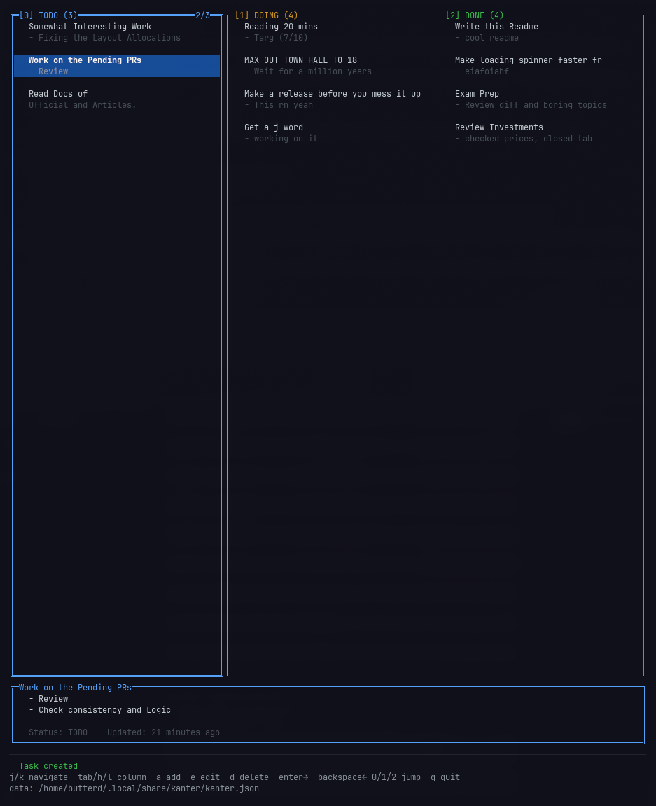
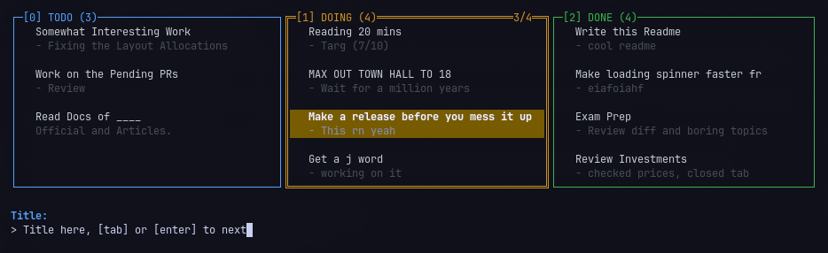
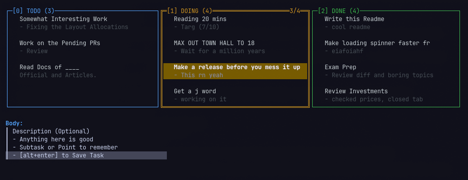

# kanter

> Terminal kanban board — keyboard-driven, minimal friction.







---

## Install

```sh
go install github.com/Nakuyu/kanter@latest
```

Then run:

```sh
kanter
```

Data is saved automatically to `~/.local/share/kanter/kanter.json`.

---

## Why

So, I used to use a whiteboard paired with sticky notes. I had a few things to do, week ahead things, even far ahead goals all placed abstractly, pointing towards a notion that this is achievable. It doesn't have to follow a fixed path. I just have to sit and work on it. So that's what I did. And it worked pretty well.

But then after the internship started, I was in and out of places a lot. I couldn't maintain that board anymore. And honestly, the visual aspect seeing what you've done, what you have to do is pretty cool.

So I started exploring apps, software, web interfaces. They were very feature rich, and uh, too many options for configuring one task. At that point, y'know, all that functionality together drains the true essence of kanban being transparent about your progress. It misses the simplistic aspect of it. These applications, albeit good, weren't exactly what I wanted. I primarily use Linux, so something on the terminal would be easy for me.

There's also this part I feel that software shouldn't be time-consuming to use. So yeah. Minimal friction in usage. Inspired by [lazygit](https://github.com/jesseduffield/lazygit) by jesseduffield and nowhere close to that is this lol.

---

## Features

- **Three columns with keyboard navigation** - TODO, DOING, DONE. Jump between columns, Move tasks forward with enter, back with backspace. Scrollable viewport when tasks overflow the terminal height.
- **Add, edit, and delete tasks** - press `a` to add with title and body, `alt+enter` to save task,  `e` to edit, `d` to delete with confirmation.
- **Adaptive layout** - four width zones: Wide (>=130), Normal (85-129), Compact (60-84), Narrow (<60). In narrow mode, the DONE column hides to give the active columns more room.
- **Detail panel** - shows the full task description below the board, outside the scroll area. Stays visible while you navigate.
- **JSON persistence** - everything auto-saves. Writes to a temp file, fsyncs, renames into place. No corruption on crash(hopefully).
- **Status messages** - feedback for every action, displayed in a stable footer and also handles Error Messages, goes away with any keypress.

---

## Keybindings

### Navigation mode

| Key | Action |
|---|---|
| `j` / `k` | Move cursor down / up |
| `h` / `l` | Move to previous / next column |
| `tab` / `shift+tab` | Next / previous column |
| `0` `1` `2` | Jump to TODO / DOING / DONE |
| `enter` | Move task forward (TODO -> DOING -> DONE) |
| `backspace` | Move task backward |
| `a` | Add a new task |
| `e` | Edit the selected task |
| `d` | Delete the selected task |

---

## Architecture

Kanter runs on [Bubble Tea](https://github.com/charmbracelet/bubbletea) - the Elm-inspired MVU framework for terminal apps. All styling is [Lip Gloss](https://github.com/charmbracelet/lipgloss).
*(Ill do an Full architecture documentation with ADRs later.)*

---

well i got a write up to use kanban better gonna drop a link here later.

---

Apache 2.0 — see [LICENSE](LICENSE).
